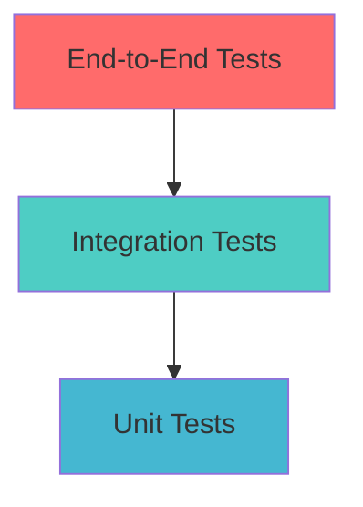

# Integration Testing Documentation

## Overview

This document provides comprehensive testing strategies and procedures for the Snatch media downloader, covering integration points between components, end-to-end testing, and validation procedures.

## Table of Contents

1. [Integration Test Strategy](#integration-test-strategy)
2. [Component Integration Tests](#component-integration-tests)
3. [End-to-End Testing](#end-to-end-testing)
4. [Plugin Integration Testing](#plugin-integration-testing)
5. [Performance Integration Tests](#performance-integration-tests)
6. [Network Integration Tests](#network-integration-tests)
7. [UI Integration Tests](#ui-integration-tests)
8. [Test Automation](#test-automation)
9. [Test Data Management](#test-data-management)
10. [Continuous Integration](#continuous-integration)

## Integration Test Strategy

### Testing Pyramid



### Integration Points

1. **CLI → Manager Integration**
2. **Manager → Session Integration**
3. **Manager → Audio Processor Integration**
4. **Manager → P2P Integration**
5. **Configuration → All Components**
6. **Plugin System Integration**
7. **Network → Download Integration**
8. **Cache → Session Integration**

## Component Integration Tests

### CLI and Manager Integration

#### Test: Download Command Flow

```python
import pytest
import asyncio
from modules.cli import EnhancedCLI
from modules.manager import AsyncDownloadManager
from modules.config import load_config

@pytest.mark.asyncio
async def test_cli_manager_integration():
    """Test CLI to Manager communication"""
    config = load_config()
    cli = EnhancedCLI(config)
    
    # Test URL validation through CLI
    test_urls = [
        "https://www.youtube.com/watch?v=dQw4w9WgXcQ",
        "https://example.com/invalid_url"
    ]
    
    for url in test_urls:
        result = await cli.validate_and_process_url(url)
        assert isinstance(result, dict)
        assert "valid" in result
        assert "metadata" in result
```

#### Test: Configuration Propagation

```python
@pytest.mark.asyncio
async def test_config_propagation():
    """Test configuration flows correctly through components"""
    config = {
        "max_concurrent_downloads": 2,
        "audio_quality": "320",
        "video_quality": "720p",
        "output_directory": "./test_output"
    }
    
    cli = EnhancedCLI(config)
    manager = AsyncDownloadManager(config)
    
    # Verify config propagated correctly
    assert manager.config["max_concurrent_downloads"] == 2
    assert manager.audio_processor.quality == "320"
    assert manager.session_manager.output_dir == "./test_output"
```

### Manager and Session Integration

#### Test: Session Persistence

```python
@pytest.mark.asyncio
async def test_session_persistence():
    """Test download session persistence and recovery"""
    config = load_config()
    manager = AsyncDownloadManager(config)
    
    test_url = "https://www.youtube.com/watch?v=dQw4w9WgXcQ"
    
    # Start download
    session_id = await manager.start_download(test_url)
    assert session_id is not None
    
    # Simulate interruption
    await manager.pause_download(session_id)
    
    # Verify session saved
    session_data = await manager.session_manager.get_session(session_id)
    assert session_data is not None
    assert session_data["status"] == "paused"
    
    # Resume download
    result = await manager.resume_download(session_id)
    assert result["success"] is True
```

### Audio Processor Integration

#### Test: Audio Processing Pipeline

```python
@pytest.mark.asyncio
async def test_audio_processing_integration():
    """Test audio processing integration with downloads"""
    config = load_config()
    config["audio_enhancement"] = True
    config["audio_format"] = "flac"
    
    manager = AsyncDownloadManager(config)
    
    # Test audio-only download with processing
    result = await manager.download_async(
        "https://www.youtube.com/watch?v=dQw4w9WgXcQ",
        {"format": "audio", "quality": "320"}
    )
    
    assert result["success"] is True
    assert result["audio_processed"] is True
    assert result["output_format"] == "flac"
```

### P2P Integration Tests

#### Test: P2P File Sharing

```python
@pytest.mark.asyncio
async def test_p2p_integration():
    """Test P2P file sharing integration"""
    config = load_config()
    config["p2p_enabled"] = True
    
    manager = AsyncDownloadManager(config)
    
    # Test P2P discovery
    peers = await manager.p2p_manager.discover_peers()
    assert isinstance(peers, list)
    
    # Test file sharing
    test_file = "test_video.mp4"
    share_result = await manager.p2p_manager.share_file(test_file)
    assert share_result["success"] is True
```

## End-to-End Testing

### Complete Download Workflow

#### Test: Full Download Process

```python
@pytest.mark.asyncio
async def test_complete_download_workflow():
    """Test complete download workflow from URL to file"""
    config = load_config()
    
    # Initialize all components
    cli = EnhancedCLI(config)
    
    test_scenarios = [
        {
            "url": "https://www.youtube.com/watch?v=dQw4w9WgXcQ",
            "format": "video",
            "quality": "720p",
            "audio_enhancement": True
        },
        {
            "url": "https://soundcloud.com/test-audio",
            "format": "audio",
            "quality": "320",
            "audio_enhancement": True
        }
    ]
    
    for scenario in test_scenarios:
        result = await cli.run_download(
            scenario["url"],
            scenario
        )
        
        assert result["success"] is True
        assert os.path.exists(result["output_file"])
        assert result["metadata"]["title"] is not None
```

### Interactive Mode Testing

#### Test: Interactive Mode Flow

```python
def test_interactive_mode_integration():
    """Test interactive mode end-to-end flow"""
    from modules.interactive_mode import InteractiveMode
    from unittest.mock import patch
    
    config = load_config()
    interactive = InteractiveMode(config)
    
    # Mock user inputs
    with patch('builtins.input', side_effect=[
        "1",  # Download option
        "https://www.youtube.com/watch?v=dQw4w9WgXcQ",  # URL
        "720p",  # Quality
        "y",  # Confirm
        "q"   # Quit
    ]):
        result = interactive.run()
        assert result["completed_downloads"] > 0
```

## Plugin Integration Testing

### Plugin Hook Testing

#### Test: Plugin Hook Execution

```python
@pytest.mark.asyncio
async def test_plugin_hook_integration():
    """Test plugin hooks are called correctly"""
    from modules.manager import AsyncDownloadManager
    from tests.mock_plugins import MockAnalyticsPlugin
    
    config = load_config()
    manager = AsyncDownloadManager(config)
    
    # Register mock plugin
    mock_plugin = MockAnalyticsPlugin()
    manager.register_hooks("test_analytics", mock_plugin)
    
    # Perform download
    result = await manager.download_async(
        "https://www.youtube.com/watch?v=dQw4w9WgXcQ"
    )
    
    # Verify plugin hooks were called
    assert mock_plugin.pre_download_called is True
    assert mock_plugin.post_download_called is True
    assert len(mock_plugin.chunk_callbacks) > 0
```

#### Test: Plugin Configuration

```python
def test_plugin_configuration_integration():
    """Test plugin configuration loading and validation"""
    config = {
        "plugins": {
            "analytics": {
                "enabled": True,
                "track_bandwidth": True,
                "save_interval": 300
            }
        }
    }
    
    from modules.plugin_manager import PluginManager
    
    plugin_manager = PluginManager(config)
    result = plugin_manager.load_plugin("analytics")
    
    assert result is True
    assert "analytics" in plugin_manager.loaded_plugins
    
    plugin = plugin_manager.get_plugin("analytics")
    assert plugin.config["track_bandwidth"] is True
```

## Performance Integration Tests

### Resource Usage Testing

#### Test: Memory Usage Under Load

```python
@pytest.mark.asyncio
async def test_memory_usage_integration():
    """Test memory usage during concurrent downloads"""
    import psutil
    import asyncio
    
    config = load_config()
    config["max_concurrent_downloads"] = 5
    
    manager = AsyncDownloadManager(config)
    
    # Monitor memory before
    process = psutil.Process()
    initial_memory = process.memory_info().rss
    
    # Start multiple downloads
    tasks = []
    test_urls = [
        "https://www.youtube.com/watch?v=dQw4w9WgXcQ",
        "https://www.youtube.com/watch?v=9bZkp7q19f0",
        "https://www.youtube.com/watch?v=ZZ5LpwO-An4"
    ]
    
    for url in test_urls:
        task = asyncio.create_task(manager.download_async(url))
        tasks.append(task)
    
    # Monitor memory during downloads
    peak_memory = initial_memory
    while not all(task.done() for task in tasks):
        current_memory = process.memory_info().rss
        peak_memory = max(peak_memory, current_memory)
        await asyncio.sleep(1)
    
    await asyncio.gather(*tasks)
    
    # Verify memory usage is reasonable
    memory_increase = peak_memory - initial_memory
    memory_increase_mb = memory_increase / 1024 / 1024
    
    assert memory_increase_mb < 500  # Less than 500MB increase
```

#### Test: Performance Monitoring Integration

```python
@pytest.mark.asyncio
async def test_performance_monitoring_integration():
    """Test performance monitoring during downloads"""
    config = load_config()
    config["performance_monitoring"] = True
    
    manager = AsyncDownloadManager(config)
    
    # Start performance monitoring
    manager.performance_monitor.start_monitoring()
    
    # Perform download
    result = await manager.download_async(
        "https://www.youtube.com/watch?v=dQw4w9WgXcQ"
    )
    
    # Check performance data was collected
    metrics = manager.performance_monitor.get_performance_summary()
    
    assert metrics["status"] == "active"
    assert metrics["data_points"] > 0
    assert "avg_cpu" in metrics
    assert "avg_memory" in metrics
    
    manager.performance_monitor.stop_monitoring()
```

## Network Integration Tests

### Connectivity Testing

#### Test: Network Resilience

```python
@pytest.mark.asyncio
async def test_network_resilience():
    """Test download resilience to network issues"""
    from unittest.mock import patch
    import aiohttp
    
    config = load_config()
    manager = AsyncDownloadManager(config)
    
    # Simulate network interruption
    with patch('aiohttp.ClientSession.get') as mock_get:
        # First few requests succeed, then fail, then succeed again
        responses = [
            mock_response(200, b"chunk1"),
            mock_response(200, b"chunk2"),
            aiohttp.ClientError("Network error"),
            aiohttp.ClientError("Network error"),
            mock_response(200, b"chunk3")
        ]
        mock_get.side_effect = responses
        
        result = await manager.download_async(
            "https://www.youtube.com/watch?v=dQw4w9WgXcQ"
        )
        
        # Should succeed despite network interruptions
        assert result["success"] is True
        assert result["retries"] > 0
```

#### Test: Speed Testing Integration

```python
@pytest.mark.asyncio
async def test_speed_testing_integration():
    """Test network speed testing integration"""
    from modules.network import NetworkManager
    
    config = load_config()
    network_manager = NetworkManager(config)
    
    # Test speed measurement
    speed_result = await network_manager.test_speed()
    
    assert "download_speed" in speed_result
    assert "upload_speed" in speed_result
    assert speed_result["download_speed"] > 0
    
    # Test adaptive quality based on speed
    manager = AsyncDownloadManager(config)
    optimal_quality = manager.get_optimal_quality(speed_result["download_speed"])
    
    assert optimal_quality in ["144p", "240p", "360p", "480p", "720p", "1080p"]
```

## UI Integration Tests

### Cyberpunk UI Testing

#### Test: UI Component Integration

```python
def test_cyberpunk_ui_integration():
    """Test cyberpunk UI integration with download system"""
    from modules.cyberpunk_ui import CyberpunkUI
    from unittest.mock import Mock
    
    config = load_config()
    ui = CyberpunkUI(config)
    
    # Mock download manager
    mock_manager = Mock()
    mock_manager.get_download_progress.return_value = {
        "current": 50,
        "total": 100,
        "speed": "1.5 MB/s",
        "eta": "30s"
    }
    
    ui.set_download_manager(mock_manager)
    
    # Test progress update
    progress_display = ui.render_progress()
    assert "50%" in progress_display
    assert "1.5 MB/s" in progress_display
```

### Textual Interface Testing

#### Test: TUI Integration

```python
@pytest.mark.asyncio
async def test_textual_interface_integration():
    """Test textual interface integration"""
    from modules.textual_interface import SnatchApp
    
    config = load_config()
    app = SnatchApp(config)
    
    # Test app initialization
    assert app.download_manager is not None
    assert app.config == config
    
    # Test format selection
    formats = await app.get_available_formats("https://www.youtube.com/watch?v=dQw4w9WgXcQ")
    assert isinstance(formats, list)
    assert len(formats) > 0
```

## Test Automation

### Automated Test Suite

#### Test Runner Configuration

```python
# conftest.py
import pytest
import asyncio
import tempfile
import shutil
from pathlib import Path

@pytest.fixture(scope="session")
def event_loop():
    """Create an instance of the default event loop for the test session."""
    loop = asyncio.get_event_loop_policy().new_event_loop()
    yield loop
    loop.close()

@pytest.fixture
def temp_config():
    """Create temporary configuration for testing"""
    temp_dir = tempfile.mkdtemp()
    config = {
        "video_output": f"{temp_dir}/video",
        "audio_output": f"{temp_dir}/audio",
        "cache_dir": f"{temp_dir}/cache",
        "sessions_dir": f"{temp_dir}/sessions",
        "max_concurrent_downloads": 2,
        "test_mode": True
    }
    
    # Create directories
    for dir_path in [config["video_output"], config["audio_output"], 
                     config["cache_dir"], config["sessions_dir"]]:
        Path(dir_path).mkdir(parents=True, exist_ok=True)
    
    yield config
    
    # Cleanup
    shutil.rmtree(temp_dir, ignore_errors=True)

@pytest.fixture
def mock_urls():
    """Provide test URLs for integration testing"""
    return {
        "youtube_video": "https://www.youtube.com/watch?v=dQw4w9WgXcQ",
        "youtube_audio": "https://www.youtube.com/watch?v=9bZkp7q19f0",
        "invalid_url": "https://example.com/nonexistent",
        "playlist": "https://www.youtube.com/playlist?list=PLExample"
    }
```

#### Integration Test Suite

```python
# test_integration_suite.py
import pytest
from modules import main_app, DownloadManager, load_config

class TestIntegrationSuite:
    """Comprehensive integration test suite"""
    
    @pytest.mark.integration
    @pytest.mark.asyncio
    async def test_full_system_integration(self, temp_config, mock_urls):
        """Test complete system integration"""
        manager = DownloadManager(temp_config)
        
        # Test video download
        result = await manager.download_async(
            mock_urls["youtube_video"],
            {"format": "video", "quality": "480p"}
        )
        assert result["success"] is True
        
        # Test audio download
        result = await manager.download_async(
            mock_urls["youtube_audio"],
            {"format": "audio", "quality": "128"}
        )
        assert result["success"] is True
    
    @pytest.mark.integration
    def test_cli_integration(self, temp_config, mock_urls):
        """Test CLI integration"""
        from modules.cli import EnhancedCLI
        
        cli = EnhancedCLI(temp_config)
        result = cli.process_command([
            "download",
            mock_urls["youtube_video"],
            "--quality", "480p"
        ])
        assert result["exit_code"] == 0
    
    @pytest.mark.integration
    @pytest.mark.slow
    async def test_concurrent_downloads(self, temp_config, mock_urls):
        """Test concurrent download integration"""
        manager = DownloadManager(temp_config)
        
        urls = [
            mock_urls["youtube_video"],
            mock_urls["youtube_audio"]
        ]
        
        results = await manager.batch_download(urls)
        assert all(r["success"] for r in results)
```

## Test Data Management

### Test Data Setup

#### Test Video Repository

```python
# test_data.py
TEST_URLS = {
    "short_video": "https://www.youtube.com/watch?v=dQw4w9WgXcQ",  # 3:33
    "long_video": "https://www.youtube.com/watch?v=9bZkp7q19f0",   # 10+ min
    "audio_only": "https://soundcloud.com/test-track",
    "playlist": "https://www.youtube.com/playlist?list=PLTest",
    "live_stream": "https://www.youtube.com/watch?v=LiveStream",
    "private_video": "https://www.youtube.com/watch?v=PrivateVid",
    "deleted_video": "https://www.youtube.com/watch?v=DeletedVid"
}

EXPECTED_RESULTS = {
    "short_video": {
        "duration": 213,  # seconds
        "title": "Rick Astley - Never Gonna Give You Up",
        "formats": ["144p", "240p", "360p", "480p", "720p"]
    }
}
```

### Mock Services

#### Mock Plugin Implementation

```python
# tests/mock_plugins.py
from modules.manager import DownloadHooks, DownloadChunk

class MockAnalyticsPlugin(DownloadHooks):
    """Mock analytics plugin for testing"""
    
    def __init__(self):
        self.pre_download_called = False
        self.post_download_called = False
        self.chunk_callbacks = []
    
    async def pre_download(self, url: str, metadata: dict) -> None:
        self.pre_download_called = True
        self.last_url = url
        self.last_metadata = metadata
    
    async def post_chunk(self, chunk: DownloadChunk, sha256: str) -> None:
        self.chunk_callbacks.append((chunk, sha256))
    
    async def post_download(self, url: str, file_path: str) -> None:
        self.post_download_called = True
        self.last_file_path = file_path
```

## Continuous Integration

### GitHub Actions Configuration

#### CI Pipeline

```yaml
# .github/workflows/integration-tests.yml
name: Integration Tests

on:
  push:
    branches: [ main, develop ]
  pull_request:
    branches: [ main ]

jobs:
  integration-tests:
    runs-on: ${{ matrix.os }}
    strategy:
      matrix:
        os: [ubuntu-latest, windows-latest, macos-latest]
        python-version: [3.9, 3.10, 3.11]
    
    steps:
    - uses: actions/checkout@v3
    
    - name: Set up Python ${{ matrix.python-version }}
      uses: actions/setup-python@v3
      with:
        python-version: ${{ matrix.python-version }}
    
    - name: Install dependencies
      run: |
        python -m pip install --upgrade pip
        pip install -r requirements.txt
        pip install -r test-requirements.txt
    
    - name: Install FFmpeg
      uses: FedericoCarboni/setup-ffmpeg@v2
    
    - name: Run integration tests
      run: |
        pytest tests/integration/ -v --cov=modules --cov-report=xml
    
    - name: Upload coverage reports
      uses: codecov/codecov-action@v3
      with:
        file: ./coverage.xml
        flags: integration
        name: integration-coverage
```

### Test Reporting

#### Coverage Configuration

```ini
# .coveragerc
[run]
source = modules
omit = 
    */tests/*
    */venv/*
    */__pycache__/*

[report]
exclude_lines =
    pragma: no cover
    def __repr__
    if self.debug:
    if settings.DEBUG
    raise AssertionError
    raise NotImplementedError
    if 0:
    if __name__ == .__main__.:
```

## Test Maintenance

### Regular Testing Schedule

1. **Unit Tests**: Run on every commit
2. **Integration Tests**: Run on every PR
3. **End-to-End Tests**: Run daily
4. **Performance Tests**: Run weekly
5. **Compatibility Tests**: Run on release

### Test Environment Management

#### Docker Test Environment

```dockerfile
# Dockerfile.test
FROM python:3.11-slim

RUN apt-get update && apt-get install -y \
    ffmpeg \
    git \
    && rm -rf /var/lib/apt/lists/*

WORKDIR /app
COPY requirements.txt test-requirements.txt ./
RUN pip install -r requirements.txt -r test-requirements.txt

COPY . .

CMD ["pytest", "tests/integration/", "-v"]
```

This comprehensive integration testing documentation ensures that all components of the Snatch system work together correctly and provides automated testing strategies for maintaining code quality.
