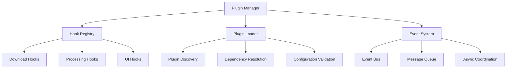

# Plugin Development Guide

## Overview

The Snatch plugin system is designed to be extensible, secure, and performant. It provides multiple extension points throughout the application lifecycle, allowing developers to customize and enhance functionality without modifying core code.

## Plugin Architecture

### System Design



### Core Interfaces

#### Base Plugin Interface

```python
from abc import ABC, abstractmethod
from typing import Dict, Any, Optional

class PluginInterface(ABC):
    """Base interface that all plugins must implement"""
    
    @property
    @abstractmethod
    def name(self) -> str:
        """Plugin name for identification"""
        pass
    
    @property
    @abstractmethod
    def version(self) -> str:
        """Plugin version string"""
        pass
    
    @property
    @abstractmethod
    def description(self) -> str:
        """Human-readable plugin description"""
        pass
    
    @abstractmethod
    async def initialize(self, config: Dict[str, Any]) -> bool:
        """Initialize plugin with configuration"""
        pass
    
    @abstractmethod
    async def cleanup(self) -> None:
        """Cleanup resources before plugin unload"""
        pass
    
    def get_capabilities(self) -> List[str]:
        """Return list of plugin capabilities"""
        return []
    
    def get_dependencies(self) -> List[str]:
        """Return list of required dependencies"""
        return []
```

## Plugin Types

### 1. Download Hooks

Download hooks allow plugins to interact with the download lifecycle at key points.

#### Interface Definition

```python
from modules.manager import DownloadHooks, DownloadChunk
from typing import Dict, Any

class DownloadPlugin(DownloadHooks, PluginInterface):
    """Base class for download plugins"""
    
    async def pre_download(self, url: str, metadata: Dict[str, Any]) -> None:
        """Called before download starts
        
        Args:
            url: The URL being downloaded
            metadata: Extracted metadata from the source
            
        Use cases:
        - URL validation and filtering
        - Custom metadata extraction
        - Download option modification
        - Bandwidth throttling setup
        """
        pass
    
    async def post_chunk(self, chunk: DownloadChunk, sha256: str) -> None:
        """Called after each chunk is downloaded
        
        Args:
            chunk: Downloaded chunk with start/end byte positions
            sha256: Hash of the chunk for integrity verification
            
        Use cases:
        - Progress tracking and analytics
        - Custom chunk validation
        - Real-time compression
        - Bandwidth monitoring
        """
        pass
    
    async def post_download(self, url: str, file_path: str) -> None:
        """Called after download completes
        
        Args:
            url: The original URL
            file_path: Path to the downloaded file
            
        Use cases:
        - File post-processing
        - Notification sending
        - Metadata tagging
        - Backup operations
        """
        pass
```

#### Example: Analytics Plugin

```python
import time
import json
from pathlib import Path
from typing import Dict, Any
from modules.manager import DownloadChunk

class AnalyticsPlugin(DownloadPlugin):
    """Plugin that tracks download analytics and performance metrics"""
    
    @property
    def name(self) -> str:
        return "analytics"
    
    @property
    def version(self) -> str:
        return "1.0.0"
    
    @property
    def description(self) -> str:
        return "Tracks download performance and usage analytics"
    
    def __init__(self):
        self.download_stats = {}
        self.analytics_file = Path("analytics/download_stats.json")
        self.analytics_file.parent.mkdir(exist_ok=True)
    
    async def initialize(self, config: Dict[str, Any]) -> bool:
        """Initialize analytics tracking"""
        self.config = config
        self.enabled = config.get("analytics", {}).get("enabled", True)
        self.track_bandwidth = config.get("analytics", {}).get("track_bandwidth", True)
        return True
    
    async def pre_download(self, url: str, metadata: Dict[str, Any]) -> None:
        """Start tracking download metrics"""
        if not self.enabled:
            return
            
        self.download_stats[url] = {
            "start_time": time.time(),
            "url": url,
            "title": metadata.get("title", "Unknown"),
            "duration": metadata.get("duration", 0),
            "filesize": metadata.get("filesize", 0),
            "format": metadata.get("format", "Unknown"),
            "chunks_downloaded": 0,
            "total_bytes": 0,
            "bandwidth_samples": []
        }
    
    async def post_chunk(self, chunk: DownloadChunk, sha256: str) -> None:
        """Track chunk download performance"""
        if not self.enabled or chunk.url not in self.download_stats:
            return
            
        stats = self.download_stats[chunk.url]
        stats["chunks_downloaded"] += 1
        stats["total_bytes"] += chunk.end - chunk.start
        
        if self.track_bandwidth:
            current_time = time.time()
            if stats["chunks_downloaded"] > 1:  # Skip first chunk for accuracy
                chunk_size = chunk.end - chunk.start
                time_diff = current_time - stats.get("last_chunk_time", current_time)
                if time_diff > 0:
                    bandwidth = chunk_size / time_diff
                    stats["bandwidth_samples"].append(bandwidth)
            
            stats["last_chunk_time"] = current_time
    
    async def post_download(self, url: str, file_path: str) -> None:
        """Finalize analytics and save to file"""
        if not self.enabled or url not in self.download_stats:
            return
            
        stats = self.download_stats[url]
        stats["end_time"] = time.time()
        stats["total_duration"] = stats["end_time"] - stats["start_time"]
        stats["file_path"] = str(file_path)
        stats["success"] = True
        
        # Calculate average bandwidth
        if stats["bandwidth_samples"]:
            stats["avg_bandwidth"] = sum(stats["bandwidth_samples"]) / len(stats["bandwidth_samples"])
            stats["max_bandwidth"] = max(stats["bandwidth_samples"])
            stats["min_bandwidth"] = min(stats["bandwidth_samples"])
        
        # Save to analytics file
        await self._save_analytics(stats)
        
        # Cleanup
        del self.download_stats[url]
    
    async def _save_analytics(self, stats: Dict[str, Any]) -> None:
        """Save analytics data to file"""
        try:
            existing_data = []
            if self.analytics_file.exists():
                with open(self.analytics_file, 'r') as f:
                    existing_data = json.load(f)
            
            existing_data.append(stats)
            
            with open(self.analytics_file, 'w') as f:
                json.dump(existing_data, f, indent=2)
                
        except Exception as e:
            print(f"Failed to save analytics: {e}")
    
    async def cleanup(self) -> None:
        """Cleanup analytics plugin"""
        # Save any remaining stats
        for url, stats in self.download_stats.items():
            stats["success"] = False
            stats["end_time"] = time.time()
            await self._save_analytics(stats)
```

### 2. Processing Plugins

Processing plugins extend the post-download file processing pipeline.

#### Interface Definition

```python
from abc import ABC, abstractmethod
from typing import Dict, Any, Optional
from pathlib import Path

class ProcessingPlugin(PluginInterface):
    """Base class for file processing plugins"""
    
    @abstractmethod
    async def process_file(self, file_path: str, metadata: Dict[str, Any],
                          options: Dict[str, Any]) -> Optional[str]:
        """Process a downloaded file
        
        Args:
            file_path: Path to the downloaded file
            metadata: File metadata and information
            options: Processing options from configuration
            
        Returns:
            Path to processed file, or None if no processing performed
        """
        pass
    
    @abstractmethod
    def supports_format(self, file_extension: str) -> bool:
        """Check if plugin supports the given file format"""
        pass
    
    def get_processing_priority(self) -> int:
        """Return processing priority (lower numbers = higher priority)"""
        return 100
```

#### Example: Thumbnail Generator Plugin

```python
import os
import subprocess
from pathlib import Path
from typing import Dict, Any, Optional

class ThumbnailPlugin(ProcessingPlugin):
    """Plugin that generates thumbnails for video files"""
    
    @property
    def name(self) -> str:
        return "thumbnail_generator"
    
    @property
    def version(self) -> str:
        return "1.0.0"
    
    @property
    def description(self) -> str:
        return "Generates thumbnails for downloaded video files"
    
    def __init__(self):
        self.ffmpeg_path = None
        self.thumbnail_dir = None
        self.supported_formats = {'.mp4', '.avi', '.mkv', '.webm', '.mov'}
    
    async def initialize(self, config: Dict[str, Any]) -> bool:
        """Initialize thumbnail generator"""
        self.config = config.get("thumbnail_generator", {})
        self.ffmpeg_path = config.get("ffmpeg_path", "ffmpeg")
        self.thumbnail_dir = Path(config.get("thumbnail_dir", "thumbnails"))
        self.thumbnail_dir.mkdir(exist_ok=True)
        
        # Verify FFmpeg is available
        try:
            result = subprocess.run([self.ffmpeg_path, "-version"], 
                                  capture_output=True, timeout=5)
            return result.returncode == 0
        except:
            return False
    
    async def process_file(self, file_path: str, metadata: Dict[str, Any],
                          options: Dict[str, Any]) -> Optional[str]:
        """Generate thumbnail for video file"""
        if not self.supports_format(Path(file_path).suffix):
            return None
        
        # Generate thumbnail filename
        video_name = Path(file_path).stem
        thumbnail_path = self.thumbnail_dir / f"{video_name}.jpg"
        
        if thumbnail_path.exists():
            return str(thumbnail_path)
        
        # Extract thumbnail at 10% duration or 30 seconds, whichever is less
        duration = metadata.get("duration", 0)
        timestamp = min(duration * 0.1, 30) if duration else 30
        
        cmd = [
            self.ffmpeg_path,
            "-i", file_path,
            "-ss", str(timestamp),
            "-vframes", "1",
            "-q:v", "2",  # High quality
            "-y",  # Overwrite
            str(thumbnail_path)
        ]
        
        try:
            result = subprocess.run(cmd, capture_output=True, timeout=60)
            if result.returncode == 0 and thumbnail_path.exists():
                return str(thumbnail_path)
        except subprocess.TimeoutExpired:
            print(f"Thumbnail generation timed out for {file_path}")
        except Exception as e:
            print(f"Error generating thumbnail: {e}")
        
        return None
    
    def supports_format(self, file_extension: str) -> bool:
        """Check if format is supported for thumbnail generation"""
        return file_extension.lower() in self.supported_formats
    
    def get_processing_priority(self) -> int:
        """Low priority - run after critical processing"""
        return 90
    
    async def cleanup(self) -> None:
        """Cleanup thumbnail generator"""
        pass
```

### 3. UI Plugins

UI plugins extend the user interface with custom components and interactions.

#### Interface Definition

```python
from abc import ABC, abstractmethod
from typing import Dict, Any, Optional, List
from rich.console import Console
from rich.table import Table

class UIPlugin(PluginInterface):
    """Base class for UI extension plugins"""
    
    @abstractmethod
    async def render_component(self, context: Dict[str, Any]) -> Any:
        """Render custom UI component"""
        pass
    
    @abstractmethod
    def get_commands(self) -> List[Dict[str, Any]]:
        """Return list of custom commands provided by plugin"""
        pass
    
    def get_menu_items(self) -> List[Dict[str, Any]]:
        """Return list of menu items to add to UI"""
        return []
```

#### Example: Status Dashboard Plugin

```python
import asyncio
from typing import Dict, Any, List
from rich.console import Console
from rich.table import Table
from rich.panel import Panel
from rich.columns import Columns
from datetime import datetime

class StatusDashboardPlugin(UIPlugin):
    """Plugin that provides a real-time status dashboard"""
    
    @property
    def name(self) -> str:
        return "status_dashboard"
    
    @property
    def version(self) -> str:
        return "1.0.0"
    
    @property
    def description(self) -> str:
        return "Provides real-time system and download status dashboard"
    
    def __init__(self):
        self.console = Console()
        self.download_manager = None
        self.system_monitor = None
    
    async def initialize(self, config: Dict[str, Any]) -> bool:
        """Initialize dashboard plugin"""
        self.config = config.get("status_dashboard", {})
        self.refresh_interval = self.config.get("refresh_interval", 2.0)
        return True
    
    async def render_component(self, context: Dict[str, Any]) -> Panel:
        """Render status dashboard component"""
        # Get data from context
        download_stats = context.get("download_stats", {})
        system_stats = context.get("system_stats", {})
        
        # Create download status table
        download_table = Table(title="Active Downloads")
        download_table.add_column("URL", style="cyan")
        download_table.add_column("Progress", style="green")
        download_table.add_column("Speed", style="yellow")
        download_table.add_column("ETA", style="magenta")
        
        for url, stats in download_stats.items():
            progress = f"{stats.get('percentage', 0):.1f}%"
            speed = f"{stats.get('speed', 0) / 1024 / 1024:.1f} MB/s"
            eta = f"{stats.get('eta', 0):.0f}s"
            download_table.add_row(url[:50] + "...", progress, speed, eta)
        
        # Create system status table
        system_table = Table(title="System Status")
        system_table.add_column("Metric", style="bold")
        system_table.add_column("Value", style="green")
        
        system_table.add_row("CPU Usage", f"{system_stats.get('cpu_percent', 0):.1f}%")
        system_table.add_row("Memory Usage", f"{system_stats.get('memory_percent', 0):.1f}%")
        system_table.add_row("Disk Usage", f"{system_stats.get('disk_percent', 0):.1f}%")
        system_table.add_row("Network Speed", f"{system_stats.get('network_speed', 0):.1f} MB/s")
        
        # Combine tables in columns
        columns = Columns([download_table, system_table], equal=True)
        
        return Panel(
            columns,
            title=f"Snatch Dashboard - {datetime.now().strftime('%H:%M:%S')}",
            border_style="blue"
        )
    
    def get_commands(self) -> List[Dict[str, Any]]:
        """Return dashboard-specific commands"""
        return [
            {
                "name": "dashboard",
                "description": "Show real-time status dashboard",
                "handler": self._show_dashboard
            },
            {
                "name": "stats",
                "description": "Show download statistics",
                "handler": self._show_stats
            }
        ]
    
    async def _show_dashboard(self, args: List[str]) -> None:
        """Show live dashboard"""
        with self.console.screen():
            while True:
                try:
                    # Gather context data
                    context = await self._gather_dashboard_data()
                    
                    # Render and display
                    dashboard = await self.render_component(context)
                    self.console.clear()
                    self.console.print(dashboard)
                    
                    await asyncio.sleep(self.refresh_interval)
                except KeyboardInterrupt:
                    break
    
    async def _show_stats(self, args: List[str]) -> None:
        """Show download statistics"""
        # Implementation for stats command
        pass
    
    async def _gather_dashboard_data(self) -> Dict[str, Any]:
        """Gather data for dashboard display"""
        # This would integrate with actual system components
        return {
            "download_stats": {},
            "system_stats": {
                "cpu_percent": 25.0,
                "memory_percent": 60.0,
                "disk_percent": 45.0,
                "network_speed": 5.2
            }
        }
    
    async def cleanup(self) -> None:
        """Cleanup dashboard plugin"""
        pass
```

## Plugin Registration and Loading

### Plugin Discovery

Plugins are discovered through multiple mechanisms:

1. **Directory Scanning**: Automatic discovery in plugin directories
2. **Explicit Registration**: Manual registration in configuration
3. **Package-based**: Installable plugin packages

#### Plugin Directory Structure

```
plugins/
├── __init__.py
├── analytics/
│   ├── __init__.py
│   ├── plugin.py
│   └── config.json
├── thumbnail_generator/
│   ├── __init__.py
│   ├── plugin.py
│   └── requirements.txt
└── custom_ui/
    ├── __init__.py
    ├── plugin.py
    └── assets/
        └── styles.css
```

### Plugin Manager Implementation

```python
import importlib
import json
from pathlib import Path
from typing import Dict, Any, List, Optional, Type

class PluginManager:
    """Manages plugin discovery, loading, and lifecycle"""
    
    def __init__(self, config: Dict[str, Any]):
        self.config = config
        self.plugins: Dict[str, PluginInterface] = {}
        self.plugin_hooks: Dict[str, List[PluginInterface]] = {}
        self.plugin_dir = Path(config.get("plugin_dir", "plugins"))
    
    async def discover_plugins(self) -> List[str]:
        """Discover available plugins"""
        discovered = []
        
        if not self.plugin_dir.exists():
            return discovered
        
        for plugin_path in self.plugin_dir.iterdir():
            if plugin_path.is_dir() and (plugin_path / "__init__.py").exists():
                try:
                    # Load plugin metadata
                    metadata_file = plugin_path / "config.json"
                    if metadata_file.exists():
                        with open(metadata_file) as f:
                            metadata = json.load(f)
                            discovered.append(metadata.get("name", plugin_path.name))
                    else:
                        discovered.append(plugin_path.name)
                except Exception as e:
                    print(f"Error discovering plugin {plugin_path}: {e}")
        
        return discovered
    
    async def load_plugin(self, plugin_name: str) -> bool:
        """Load and initialize a specific plugin"""
        try:
            plugin_path = self.plugin_dir / plugin_name
            if not plugin_path.exists():
                return False
            
            # Import plugin module
            spec = importlib.util.spec_from_file_location(
                f"plugins.{plugin_name}",
                plugin_path / "plugin.py"
            )
            module = importlib.util.module_from_spec(spec)
            spec.loader.exec_module(module)
            
            # Get plugin class (assume it's named Plugin)
            plugin_class = getattr(module, "Plugin", None)
            if not plugin_class:
                print(f"No Plugin class found in {plugin_name}")
                return False
            
            # Instantiate and initialize
            plugin_instance = plugin_class()
            plugin_config = self.config.get("plugins", {}).get(plugin_name, {})
            
            if await plugin_instance.initialize(plugin_config):
                self.plugins[plugin_name] = plugin_instance
                await self._register_plugin_hooks(plugin_instance)
                return True
            
        except Exception as e:
            print(f"Error loading plugin {plugin_name}: {e}")
        
        return False
    
    async def _register_plugin_hooks(self, plugin: PluginInterface) -> None:
        """Register plugin hooks with appropriate systems"""
        if isinstance(plugin, DownloadPlugin):
            # Register with download manager
            hook_list = self.plugin_hooks.setdefault("download", [])
            hook_list.append(plugin)
        
        if isinstance(plugin, ProcessingPlugin):
            # Register with processing pipeline
            hook_list = self.plugin_hooks.setdefault("processing", [])
            hook_list.append(plugin)
        
        if isinstance(plugin, UIPlugin):
            # Register with UI system
            hook_list = self.plugin_hooks.setdefault("ui", [])
            hook_list.append(plugin)
    
    async def unload_plugin(self, plugin_name: str) -> bool:
        """Unload a plugin and cleanup resources"""
        if plugin_name in self.plugins:
            plugin = self.plugins[plugin_name]
            await plugin.cleanup()
            del self.plugins[plugin_name]
            
            # Remove from hook lists
            for hook_list in self.plugin_hooks.values():
                if plugin in hook_list:
                    hook_list.remove(plugin)
            
            return True
        return False
    
    async def call_hooks(self, hook_type: str, method_name: str, *args, **kwargs) -> None:
        """Call all registered hooks of a specific type"""
        if hook_type in self.plugin_hooks:
            for plugin in self.plugin_hooks[hook_type]:
                try:
                    method = getattr(plugin, method_name, None)
                    if method:
                        await method(*args, **kwargs)
                except Exception as e:
                    print(f"Error calling {method_name} on {plugin.name}: {e}")
```

## Configuration and Best Practices

### Plugin Configuration Schema

```json
{
  "plugins": {
    "analytics": {
      "enabled": true,
      "priority": 10,
      "config": {
        "track_bandwidth": true,
        "save_interval": 300,
        "analytics_file": "analytics/stats.json"
      }
    },
    "thumbnail_generator": {
      "enabled": true,
      "priority": 20,
      "config": {
        "thumbnail_dir": "thumbnails",
        "quality": "high",
        "timestamp_percent": 10
      }
    }
  }
}
```

### Best Practices

1. **Error Handling**: Always wrap plugin operations in try-catch blocks
2. **Resource Management**: Properly cleanup resources in the cleanup method
3. **Async Design**: Use async/await for I/O operations
4. **Configuration**: Make plugins configurable and provide sensible defaults
5. **Documentation**: Document plugin capabilities and configuration options
6. **Testing**: Include unit tests for plugin functionality
7. **Performance**: Avoid blocking operations in hooks
8. **Security**: Validate inputs and sanitize outputs

### Plugin Testing Framework

```python
import pytest
import asyncio
from unittest.mock import Mock, AsyncMock

class PluginTestCase:
    """Base test case for plugin testing"""
    
    @pytest.fixture
    async def plugin_instance(self):
        """Create plugin instance for testing"""
        plugin = YourPlugin()
        config = {"test_mode": True}
        await plugin.initialize(config)
        yield plugin
        await plugin.cleanup()
    
    @pytest.mark.asyncio
    async def test_plugin_initialization(self, plugin_instance):
        """Test plugin initializes correctly"""
        assert plugin_instance.name
        assert plugin_instance.version
        assert plugin_instance.description
    
    @pytest.mark.asyncio
    async def test_download_hooks(self, plugin_instance):
        """Test download hook functionality"""
        # Mock data
        url = "https://example.com/video"
        metadata = {"title": "Test Video", "duration": 300}
        
        # Test pre_download hook
        await plugin_instance.pre_download(url, metadata)
        
        # Verify expected behavior
        # ... assertions
```

This comprehensive plugin development guide provides everything needed to create robust, efficient plugins for the Snatch system. Plugins can extend functionality while maintaining clean separation of concerns and following established patterns.
